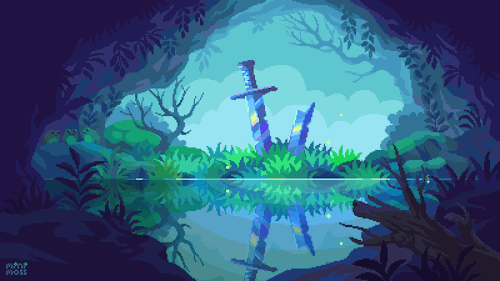

<!-- ============ BANNER (custom asset — see notes below) ============ -->

<!-- ============ PIXEL TITLE ============ -->

 

 

░▒▓█ **THE JOURNAL** █▓▒░

> *Every party has a beginning — a village, a tavern, a half-finished spellbook.*
> *Mine started with a broken build and a "Hello, World!" that took three tries to compile.*
> *Still on the road. Still leveling up. Still taking the long way, on purpose.*

 

| 🧙 Class | Full-Stack Developer / UI Alchemist |
|:--|:--|
| 🏰 Guild | Information Systems — Student |
| 📜 Current Quest | Building **iChoose Care** — a Laravel + MySQL service-shop management system |
| 🗺️ Terrain | Web · Mobile · Data · Networking |
| ✨ Passive Skill | Turning plain UIs into pixel-perfect, aesthetic ones |
| 📍 Camped At | Bandung, West Java |

 

░▒▓█ **ARSENAL** █▓▒░

 

░▒▓█ **STATUS WINDOW** █▓▒░

 

 

░▒▓█ **QUEST LOG** █▓▒░

<table width="100%">
<tr>
<td width="60%">

**🟢 iChoose Care** — in progress
Multi-role iPhone service-shop management system built as a thesis project, with custom auth and structured business logic.

</td>
<td>

</td>
</tr>
<tr>
<td>

**✅ Game Dev Team Portfolio** — completed
A retro arcade / pixel-art themed portfolio site, hand-tuned with custom CSS animations and pixel effects.

</td>
<td>

</td>
</tr>
<tr>
<td>

**✅ INKVERSE** — completed
UI/UX concept for a mobile comic reader app, designed across Figma and React Native.

</td>
<td>

</td>
</tr>
<tr>
<td>

**✅ Manga Viewer** — completed
A manga detail & chapter reader consuming a third-party API, built with Vue 3 and TypeScript.

</td>
<td>

</td>
</tr>
<tr>
<td>

**✅ Scientific Calculator** — completed
An Android app with a recursive-descent expression parser, built in Kotlin.

</td>
<td>

</td>
</tr>
</table>

 

░▒▓█ **THE MAP GROWS** █▓▒░

<picture>
  <source media="(prefers-color-scheme: dark)" srcset="https://raw.githubusercontent.com/YOUR_USERNAME/YOUR_USERNAME/output/github-contribution-grid-snake-dark.svg"/>
  
</picture>

 

░▒▓█ **CALL FOR PARTY MEMBERS** █▓▒░

 

Thanks for stopping by the campfire. Safe travels. ✦

